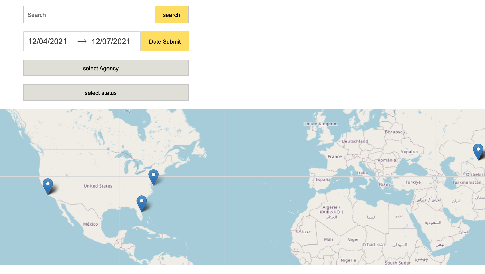
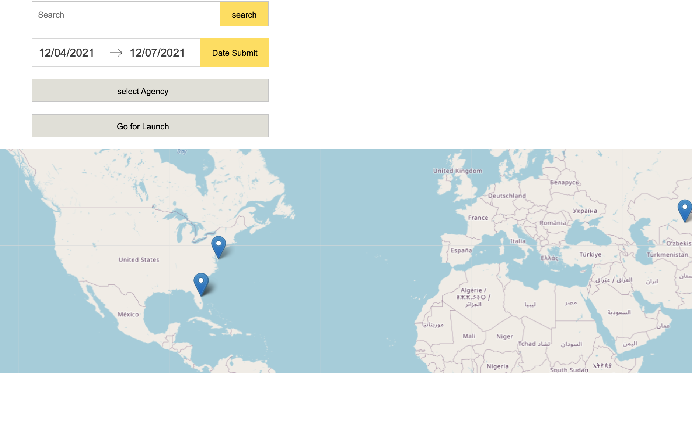
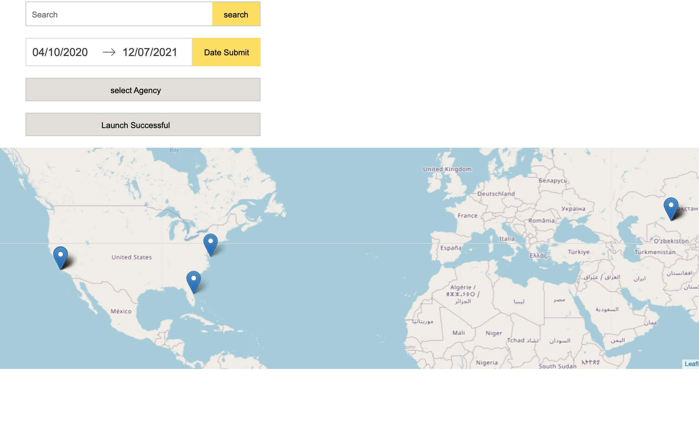
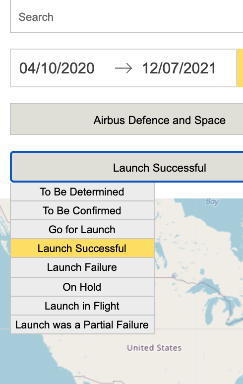
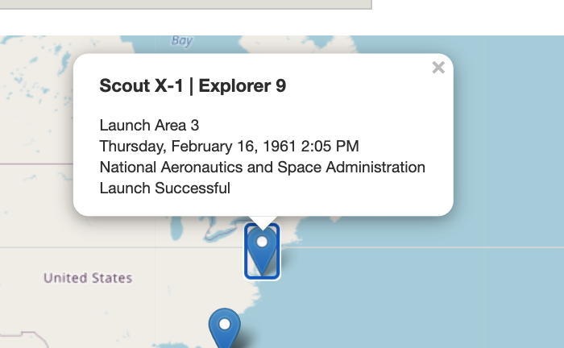

# Getting Started with moonshot App

This project allows to see rocket spots and information on the map, with filters.

App is not compeleted..

Simple api used :
https://lldev.thespacedevs.com/2.2.0/swagger

## Available Scripts

In the project directory, you can run:

### `npm install --legacy-peer-deps`

Install packages before you run this app.

### `npm start`

Runs the app in the development mode.\
Open [http://localhost:3000](http://localhost:3000) to view it in the browser.

The page will reload if you make edits.\
You will also see any lint errors in the console.

## Essential Requests

- [x] The app should be a React application.
- [x] The app should use the API provided by Launch Library.
- [x] The app should be built with TypeScript.
- [ ] The app should include tests.

## TODO Requests

- [x] As a user, when I open the app, I want to see all the launches for the next 3 months, plotted on a map or globe.

- [x] Asauser,IwanttobeabletoselectastartdateandanenddatesoIcanfilterthe launches according to my selection.

- [x] Asauser,Iwanttobeabletoselectapointonthemapandseethename,timeof launch, name of the launch pad and the agencies that are collaborating on the launch.

- [ ] As a user, I want to be able to see the first occurring launch depending on my start date and end date selection.

- [ ] As a user, I want to be able to filter the launches based on the agencies that are participating in the launches that are relevant to my selection of start and end date.
      **not fully understood api flow, so that , app behave wrongly with agency filter**

- [x] As a user, I want to be able to filter the launches based on whether or not they were successful.

- [x] As a user, I want to receive feedback when the app encounters an error in reaching the API.

## Quick overview

**No.1**

**No.2**

**No.3 - when user selected only 1 product**

**No.4 - from middle size screen**

**No.5 - from middle size screen**

## Code

**Not happy with structer**
**variable name upper case, low case miss using**
**Should be more improve TypeScript coding**
**No test..**
**did not use useReducer yet..**
**should add reset all filter button**
